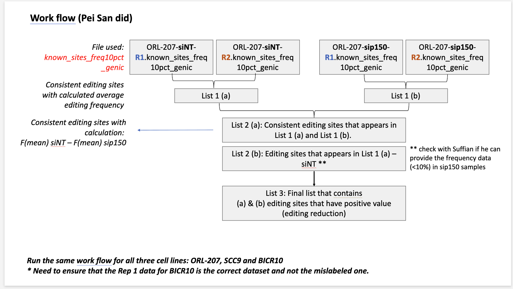
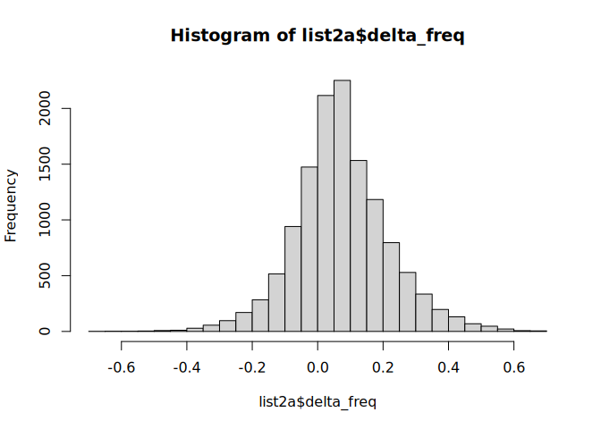

# reddisco-quarto


## RNA Editing Quarto Notebook (Downstream Analysis)

This notebook processes per-sample, per-replicate RNA editing output
from RediTools v1 and replicates the manual filtering workflow in a
reproducible, scripted form.

The workflow for each cell line is designed based on this manual
workflow from Pei San:



1.  **Recovery step** — for each replicate, sites in the master
    annotation set that fell below the upstream 10% frequency filter are
    recovered from the pre-filter file and re-attached with their actual
    FREQ and COV values (or 0 if truly absent).
2.  **List 1(a/b)** — intersect replicates within each condition (sites
    with FREQ \> 0 in both replicates); compute per-site mean FREQ.
3.  **List 2(a)** — intersect siNT and sip150 consistent sites; compute
    Δ = F(mean)siNT − F(mean)sip150.
4.  **List 2(b)** — sites present in siNT (List 1a) but absent from
    sip150 (List 1b).
5.  **List 3** — union of List 2(a) with positive Δ and List 2(b): final
    editing-reduction sites.

------------------------------------------------------------------------

## Setup

``` r
library(tidyverse)
library(fs)
```

------------------------------------------------------------------------

## Configuration

``` r
# Root directory containing all TSV files, organised by cell line.
# Expected structure:
#   input-data/
#       ORL-207/
#         ORL-207-siNT-R1.known_sites_freq10pct_genic.tsv  <- annotated (SnpEff)
#         ORL-207-siNT-R1-knownEditing-labeled.tsv         <- pre-filter (knownEditing)
#         ... (same pattern for R2, sip150-R1, sip150-R2)
#       SCC9/  ...
#       BICR10/  ...  (ensure R1 is the corrected, relabelled file)

DATA_DIR <- "input-data"

# Cell lines to process
CELL_LINES <- c("ORL-207", "SCC9", "BICR10")

# File suffix for the SnpEff-annotated, frequency-filtered files
ANNOTATED_SUFFIX <- "known_sites_freq10pct_genic.tsv"

# File suffix for the pre-filter files (AG-only, no frequency cutoff, no header)
PREFILTER_SUFFIX <- "knownEditing-labeled.tsv"

# Columns used to uniquely identify an editing site across files
SITE_KEYS <- c("CHROM", "POS")

# Column names for the headerless pre-filter file (RediTools AG-filtered output)
PREFILTER_COLS <- c(
  "CHROM", "POS", "REF", "STRAND", "COV", "MeanQ",
  "BaseCount", "AllSubs", "FREQ",
  "gCOV", "gMeanQ", "gBaseCount", "gAllSubs", "gFREQ",
  "REPTYPE", "REPNAME", "SNPFlag", "dbSNP_ID",
  "REDIPortalFlag", "EDITSTATUS"
)
```

------------------------------------------------------------------------

## Helper functions

### File readers

``` r
# Read a SnpEff-annotated, frequency-filtered TSV and rename awkward ANN columns
read_annotated_tsv <- function(path) {
  read_tsv(path, show_col_types = FALSE) |>
    rename(
      gene    = `ANN[0].GENE`,
      feature = `ANN[0].FEATUREID`,
      effect  = `ANN[0].EFFECT`,
      impact  = `ANN[0].IMPACT`,
      biotype = `ANN[0].BIOTYPE`,
      hgvs_c  = `ANN[0].HGVS_C`
    )
}

# Read a headerless pre-filter TSV (RediTools AG-only output, no frequency cutoff)
read_prefilter_tsv <- function(path) {
  read_tsv(path, col_names = PREFILTER_COLS, show_col_types = FALSE)
}

# Build a file path given cell line, condition, replicate, and suffix
build_path <- function(cell_line, condition, replicate, suffix, sep = "-") {
  path(DATA_DIR, cell_line,
       paste0(cell_line, "-", condition, "-", replicate, sep, suffix))
}
```

### Site Recovery Step

To recover sites that might have been “called” as AG edited sites but
fell off during the hard frequency threshold filtering at the time of
annotation, we would be executing the strategy visualized below to
“recover” them from the replicate sample files (pre-filter files) across
the two conditions (siNT & sip150).


``` r
# Build a master annotation table from all four annotated files for a cell line.
# Keeps the first-seen annotation for any site that appears in multiple files.
# This is purely the union of what already passed the upstream filter. It's the reference set that the recovery step later uses to ask "what did this specific replicate miss?"
build_master_annotation <- function(cell_line) {
  combos <- expand_grid(
    condition = c("siNT", "sip150"),
    replicate = c("R1", "R2")
  )

  map2(combos$condition, combos$replicate, function(cond, rep) {
    p <- build_path(cell_line, cond, rep, ANNOTATED_SUFFIX, sep = ".")
    if (file_exists(p)) read_annotated_tsv(p) else NULL
  }) |>
    compact() |>
    bind_rows() |>
    distinct(CHROM, POS, .keep_all = TRUE)
}

# For one replicate: recover sites in the master annotation set that were dropped by the upstream frequency filter.
# Returns the annotated dataframe with dropped sites re-attached (FREQ and COV from the pre-filter file, or 0 if truly absent).
# A `recovered` column flags which rows were added this way.
recover_replicate <- function(annotated_df, prefilter_path, master_annot) {
  # Sites in the master that are absent from this replicate's annotated file
  missing <- anti_join(master_annot, annotated_df, by = SITE_KEYS)
  if (nrow(missing) == 0) {
    return(mutate(annotated_df, recovered = FALSE))
  }

  # Pull FREQ and COV for missing sites from the pre-filter file
  prefilter <- read_prefilter_tsv(prefilter_path) |>
    select(CHROM, POS, FREQ, COV)

  recovered_rows <- missing |>
    # Keep annotation columns only (FREQ/COV will come from pre-filter)
    select(CHROM, POS, REF, ALT, STRAND,
           gene, feature, effect, impact, biotype, hgvs_c,
           REPTYPE, REPNAME, EDITSTATUS) |>
    left_join(prefilter, by = SITE_KEYS) |>
    mutate(
      FREQ      = replace_na(FREQ, 0),   # 0 = truly absent in this replicate
      COV       = replace_na(COV,  0),
      recovered = TRUE
    )

  bind_rows(
    mutate(annotated_df, recovered = FALSE),
    recovered_rows
  )
}

# Load and recover sites based on one replicate pre-filter and tailor master dataframe: wrapper that calls both readers and recover_replicate
load_and_recover_replicate_to_master_df <- function(cell_line, condition, replicate, master_annot) {
  ann_path <- build_path(cell_line, condition, replicate, ANNOTATED_SUFFIX, sep = ".")
  pre_path <- build_path(cell_line, condition, replicate, PREFILTER_SUFFIX, sep = "-")

  annotated <- read_annotated_tsv(ann_path)
  recover_replicate(annotated, pre_path, master_annot)
}
```

### List-building functions

``` r
# List 1: intersect two replicates for one condition.
# "Consistent" = site has FREQ > 0 in BOTH replicates after recovery.
# Returns per-site mean FREQ with individual replicate FREQs retained.
make_list1 <- function(r1_df, r2_df, condition_label) {
  inner_join(
    r1_df |> select(all_of(SITE_KEYS), gene, effect, impact, biotype,
                    REPTYPE, REPNAME, EDITSTATUS, STRAND,
                    freq_R1 = FREQ, cov_R1 = COV, recovered_R1 = recovered),
    r2_df |> select(all_of(SITE_KEYS),
                    freq_R2 = FREQ, cov_R2 = COV, recovered_R2 = recovered),
    by = SITE_KEYS
  ) |>
    filter(freq_R1 > 0, freq_R2 > 0) |>   # both replicates must show evidence
    mutate(
      condition    = condition_label,
      mean_freq    = (freq_R1 + freq_R2) / 2,
      mean_cov     = (cov_R1  + cov_R2)  / 2,
      any_recovered = recovered_R1 | recovered_R2
    )
}

# List 2(a): sites consistent in BOTH conditions.
# Computes delta = F(mean)siNT - F(mean)sip150.
make_list2a <- function(list1a, list1b) {
  inner_join(
    list1a |> select(all_of(SITE_KEYS), gene, effect, impact, biotype,
                     REPTYPE, REPNAME, EDITSTATUS, STRAND,
                     mean_freq_siNT   = mean_freq,
                     mean_cov_siNT    = mean_cov,
                     freq_R1_siNT     = freq_R1,
                     freq_R2_siNT     = freq_R2,
                     recovered_siNT   = any_recovered),
    list1b |> select(all_of(SITE_KEYS),
                     mean_freq_sip150 = mean_freq,
                     mean_cov_sip150  = mean_cov,
                     freq_R1_sip150   = freq_R1,
                     freq_R2_sip150   = freq_R2,
                     recovered_sip150 = any_recovered),
    by = SITE_KEYS
  ) |>
    mutate(
      delta_freq    = mean_freq_siNT - mean_freq_sip150,
      list_origin   = "2a_shared",
      sip150_status = "present_consistent"
    )
}

# List 2(b): sites in siNT only (absent from sip150 consistent list).
make_list2b <- function(list1a, list1b, sip150_r1, sip150_r2) {

  sip150_cov <- bind_rows(
    sip150_r1 |> select(CHROM, POS, COV, FREQ),
    sip150_r2 |> select(CHROM, POS, COV, FREQ)
  ) |>
    group_by(CHROM, POS) |>
    summarise(
      mean_cov_sip150  = mean(COV,  na.rm = TRUE),
      mean_freq_sip150 = mean(FREQ, na.rm = TRUE),
      .groups = "drop"
    )

  anti_join(list1a, list1b, by = SITE_KEYS) |>
    left_join(sip150_cov, by = SITE_KEYS) |>
    mutate(
      delta_freq    = mean_freq,
      list_origin   = "2b_siNT_only",
      sip150_status = case_when(
         is.na(mean_freq_sip150) | mean_freq_sip150 == 0 ~ "not_in_prefilter",
         mean_freq_sip150 > 0                            ~ "sub_threshold"
      )
    )
}

# List 3: editing-reduction sites.
# List 2(a) with positive delta  +  all List 2(b).
make_list3 <- function(list2a, list2b) {
  bind_rows(
    filter(list2a, delta_freq > 0),
    list2b
  ) |>
    arrange(desc(delta_freq))
}

# Master function: run the full workflow for one cell line
run_workflow <- function(cell_line) {
  message("\n── Processing: ", cell_line, " ──")

  # Build master annotation from all four annotated files
  master <- build_master_annotation(cell_line)
  message("  Master annotation set: ", nrow(master), " sites")

  # Load and recover each replicate
  siNT_R1   <- load_and_recover_replicate_to_master_df(cell_line, "siNT",   "R1", master)
  siNT_R2   <- load_and_recover_replicate_to_master_df(cell_line, "siNT",   "R2", master)
  sip150_R1 <- load_and_recover_replicate_to_master_df(cell_line, "sip150", "R1", master)
  sip150_R2 <- load_and_recover_replicate_to_master_df(cell_line, "sip150", "R2", master)

  message("  Recovered sites — siNT-R1: ",   sum(siNT_R1$recovered),
          "  siNT-R2: ",                      sum(siNT_R2$recovered),
          "  sip150-R1: ",                    sum(sip150_R1$recovered),
          "  sip150-R2: ",                    sum(sip150_R2$recovered))

  list1a <- make_list1(siNT_R1,   siNT_R2,   "siNT")
  list1b <- make_list1(sip150_R1, sip150_R2, "sip150")
  list2a <- make_list2a(list1a, list1b)
  list2b <- make_list2b(list1a, list1b, sip150_R1, sip150_R2)
  list3  <- make_list3(list2a, list2b)

  list(
    cell_line = cell_line,
    list1a    = list1a,
    list1b    = list1b,
    list2a    = list2a,
    list2b    = list2b,
    list3     = list3
  )
}
```

``` r
# ── SCRATCH: sanity check with ORL-207 only ──────────────────────

# Step 1: read one annotated file directly and inspect
test_ann <- read_annotated_tsv(
  build_path("ORL-207", "siNT", "R1", ANNOTATED_SUFFIX, sep = ".")
)
glimpse(test_ann)
```

    Rows: 68,573
    Columns: 16
    $ CHROM      <chr> "chrX", "chrX", "chrX", "chrX", "chrX", "chrX", "chrX", "ch…
    $ POS        <dbl> 2792993, 2793061, 2803982, 2803988, 2811619, 2811713, 29061…
    $ REF        <chr> "A", "A", "A", "A", "A", "A", "T", "T", "T", "T", "T", "T",…
    $ ALT        <chr> "G", "G", "G", "G", "G", "G", "C", "C", "C", "C", "C", "C",…
    $ gene       <chr> "XG", "XG", "XG", "XG", "XG", "XG", "ARSD", "ARSD", "ARSD",…
    $ feature    <chr> "NM_001141919.1", "NM_001141919.1", "NM_001141919.1", "NM_0…
    $ effect     <chr> "intron_variant", "intron_variant", "intron_variant", "intr…
    $ impact     <chr> "MODIFIER", "MODIFIER", "MODIFIER", "MODIFIER", "MODIFIER",…
    $ biotype    <chr> "protein_coding", "protein_coding", "protein_coding", "prot…
    $ hgvs_c     <chr> "c.254-1542A>G", "c.254-1474A>G", "c.374-2719A>G", "c.374-2…
    $ STRAND     <dbl> 1, 1, 1, 1, 1, 1, 0, 0, 0, 0, 0, 0, 0, 0, 0, 0, 0, 0, 0, 0,…
    $ FREQ       <dbl> 0.27, 0.33, 0.20, 0.40, 0.14, 0.17, 0.18, 0.29, 0.59, 0.13,…
    $ COV        <dbl> 11, 12, 5, 5, 7, 6, 45, 48, 41, 52, 53, 54, 52, 53, 54, 47,…
    $ REPTYPE    <chr> "SINE", "SINE", "SINE", "SINE", "SINE", "SINE", "SINE", "SI…
    $ REPNAME    <chr> "AluJo", "AluJo", "AluSx", "AluSx", "AluSz", "AluSz", "AluJ…
    $ EDITSTATUS <chr> "KNOWN_ALU", "KNOWN_ALU", "KNOWN_ALU", "KNOWN_ALU", "KNOWN_…

``` r
head(test_ann)
```

    # A tibble: 6 × 16
      CHROM     POS REF   ALT   gene  feature    effect impact biotype hgvs_c STRAND
      <chr>   <dbl> <chr> <chr> <chr> <chr>      <chr>  <chr>  <chr>   <chr>   <dbl>
    1 chrX  2792993 A     G     XG    NM_001141… intro… MODIF… protei… c.254…      1
    2 chrX  2793061 A     G     XG    NM_001141… intro… MODIF… protei… c.254…      1
    3 chrX  2803982 A     G     XG    NM_001141… intro… MODIF… protei… c.374…      1
    4 chrX  2803988 A     G     XG    NM_001141… intro… MODIF… protei… c.374…      1
    5 chrX  2811619 A     G     XG    NM_001141… intro… MODIF… protei… c.571…      1
    6 chrX  2811713 A     G     XG    NM_001141… intro… MODIF… protei… c.571…      1
    # ℹ 5 more variables: FREQ <dbl>, COV <dbl>, REPTYPE <chr>, REPNAME <chr>,
    #   EDITSTATUS <chr>

``` r
nrow(test_ann)
```

    [1] 68573

``` r
# Step 2: read one pre-filter file directly and inspect
test_pre <- read_prefilter_tsv(
  build_path("ORL-207", "siNT", "R1", PREFILTER_SUFFIX, sep = "-")
)
glimpse(test_pre)
```

    Rows: 118,968
    Columns: 20
    $ CHROM          <chr> "chrY", "chrX", "chrX", "chrX", "chrX", "chrX", "chrX",…
    $ POS            <dbl> 18991592, 2792983, 2792993, 2793000, 2793061, 2803982, …
    $ REF            <chr> "A", "A", "A", "A", "A", "A", "A", "A", "A", "A", "A", …
    $ STRAND         <dbl> 0, 1, 1, 1, 1, 1, 1, 1, 1, 0, 0, 0, 0, 0, 0, 0, 0, 0, 0…
    $ COV            <dbl> 24, 11, 11, 11, 12, 5, 5, 7, 6, 35, 45, 48, 43, 42, 41,…
    $ MeanQ          <dbl> 50.38, 37.00, 40.36, 40.36, 43.17, 42.00, 44.40, 40.57,…
    $ BaseCount      <chr> "[22, 0, 2, 0]", "[10, 0, 1, 0]", "[8, 0, 3, 0]", "[10,…
    $ AllSubs        <chr> "AG", "AG", "AG", "AG", "AG", "AG", "AG", "AG", "AG", "…
    $ FREQ           <dbl> 0.08, 0.09, 0.27, 0.09, 0.33, 0.20, 0.40, 0.14, 0.17, 0…
    $ gCOV           <chr> "-", "7", "7", "6", "8", "5", "3", "8", "4", "5", "6", …
    $ gMeanQ         <chr> "-", "37.00", "37.00", "37.00", "37.00", "37.00", "37.0…
    $ gBaseCount     <chr> "-", "[7, 0, 0, 0]", "[7, 0, 0, 0]", "[6, 0, 0, 0]", "[…
    $ gAllSubs       <chr> "-", "-", "-", "-", "-", "-", "-", "-", "-", "-", "-", …
    $ gFREQ          <chr> "-", "0.00", "0.00", "0.00", "0.00", "0.00", "0.00", "0…
    $ REPTYPE        <chr> "SINE", "SINE", "SINE", "SINE", "SINE", "SINE", "SINE",…
    $ REPNAME        <chr> "AluSx1", "AluJo", "AluJo", "AluJo", "AluJo", "AluSx", …
    $ SNPFlag        <chr> "-", "-", "snp", "-", "-", "-", "-", "-", "-", "-", "-"…
    $ dbSNP_ID       <chr> "-", "-", "rs780403911", "-", "-", "-", "-", "-", "-", …
    $ REDIPortalFlag <chr> "ed", "ed", "ed", "ed", "ed", "ed", "ed", "ed", "ed", "…
    $ EDITSTATUS     <chr> "KNOWN_ALU", "KNOWN_ALU", "KNOWN_ALU", "KNOWN_ALU", "KN…

``` r
head(test_pre)
```

    # A tibble: 6 × 20
      CHROM      POS REF   STRAND   COV MeanQ BaseCount   AllSubs  FREQ gCOV  gMeanQ
      <chr>    <dbl> <chr>  <dbl> <dbl> <dbl> <chr>       <chr>   <dbl> <chr> <chr> 
    1 chrY  18991592 A          0    24  50.4 [22, 0, 2,… AG       0.08 -     -     
    2 chrX   2792983 A          1    11  37   [10, 0, 1,… AG       0.09 7     37.00 
    3 chrX   2792993 A          1    11  40.4 [8, 0, 3, … AG       0.27 7     37.00 
    4 chrX   2793000 A          1    11  40.4 [10, 0, 1,… AG       0.09 6     37.00 
    5 chrX   2793061 A          1    12  43.2 [8, 0, 4, … AG       0.33 8     37.00 
    6 chrX   2803982 A          1     5  42   [4, 0, 1, … AG       0.2  5     37.00 
    # ℹ 9 more variables: gBaseCount <chr>, gAllSubs <chr>, gFREQ <chr>,
    #   REPTYPE <chr>, REPNAME <chr>, SNPFlag <chr>, dbSNP_ID <chr>,
    #   REDIPortalFlag <chr>, EDITSTATUS <chr>

``` r
# Step 3: build master annotation and inspect
master <- build_master_annotation("ORL-207")
nrow(master)       # how many unique sites across all 4 files?
```

    [1] 140951

``` r
glimpse(master)
```

    Rows: 140,951
    Columns: 16
    $ CHROM      <chr> "chrX", "chrX", "chrX", "chrX", "chrX", "chrX", "chrX", "ch…
    $ POS        <dbl> 2792993, 2793061, 2803982, 2803988, 2811619, 2811713, 29061…
    $ REF        <chr> "A", "A", "A", "A", "A", "A", "T", "T", "T", "T", "T", "T",…
    $ ALT        <chr> "G", "G", "G", "G", "G", "G", "C", "C", "C", "C", "C", "C",…
    $ gene       <chr> "XG", "XG", "XG", "XG", "XG", "XG", "ARSD", "ARSD", "ARSD",…
    $ feature    <chr> "NM_001141919.1", "NM_001141919.1", "NM_001141919.1", "NM_0…
    $ effect     <chr> "intron_variant", "intron_variant", "intron_variant", "intr…
    $ impact     <chr> "MODIFIER", "MODIFIER", "MODIFIER", "MODIFIER", "MODIFIER",…
    $ biotype    <chr> "protein_coding", "protein_coding", "protein_coding", "prot…
    $ hgvs_c     <chr> "c.254-1542A>G", "c.254-1474A>G", "c.374-2719A>G", "c.374-2…
    $ STRAND     <dbl> 1, 1, 1, 1, 1, 1, 0, 0, 0, 0, 0, 0, 0, 0, 0, 0, 0, 0, 0, 0,…
    $ FREQ       <dbl> 0.27, 0.33, 0.20, 0.40, 0.14, 0.17, 0.18, 0.29, 0.59, 0.13,…
    $ COV        <dbl> 11, 12, 5, 5, 7, 6, 45, 48, 41, 52, 53, 54, 52, 53, 54, 47,…
    $ REPTYPE    <chr> "SINE", "SINE", "SINE", "SINE", "SINE", "SINE", "SINE", "SI…
    $ REPNAME    <chr> "AluJo", "AluJo", "AluSx", "AluSx", "AluSz", "AluSz", "AluJ…
    $ EDITSTATUS <chr> "KNOWN_ALU", "KNOWN_ALU", "KNOWN_ALU", "KNOWN_ALU", "KNOWN_…

``` r
# Step 4: load and recover ONE replicate -> anti-join master with rep+condition annotated file; anything missing in the annotated file but present in the master union file means either in this rep+cond its freq and cov are too low, or they are truly absent (or zero as third possibility)
siNT_R1 <- load_and_recover_replicate_to_master_df("ORL-207", "siNT", "R1", master)
nrow(siNT_R1)
```

    [1] 140951

``` r
head(siNT_R1)
```

    # A tibble: 6 × 17
      CHROM     POS REF   ALT   gene  feature    effect impact biotype hgvs_c STRAND
      <chr>   <dbl> <chr> <chr> <chr> <chr>      <chr>  <chr>  <chr>   <chr>   <dbl>
    1 chrX  2792993 A     G     XG    NM_001141… intro… MODIF… protei… c.254…      1
    2 chrX  2793061 A     G     XG    NM_001141… intro… MODIF… protei… c.254…      1
    3 chrX  2803982 A     G     XG    NM_001141… intro… MODIF… protei… c.374…      1
    4 chrX  2803988 A     G     XG    NM_001141… intro… MODIF… protei… c.374…      1
    5 chrX  2811619 A     G     XG    NM_001141… intro… MODIF… protei… c.571…      1
    6 chrX  2811713 A     G     XG    NM_001141… intro… MODIF… protei… c.571…      1
    # ℹ 6 more variables: FREQ <dbl>, COV <dbl>, REPTYPE <chr>, REPNAME <chr>,
    #   EDITSTATUS <chr>, recovered <lgl>

``` r
count(siNT_R1, recovered)    # how many rows were recovered vs primary?
```

    # A tibble: 2 × 2
      recovered     n
      <lgl>     <int>
    1 FALSE     68573
    2 TRUE      72378

``` r
# do the recovered sites have plausible FREQ values, or are they mostly 0?
filter(siNT_R1, recovered == TRUE) |>
  pull(FREQ) |>
  summary()
```

        Min.  1st Qu.   Median     Mean  3rd Qu.     Max. 
    0.000000 0.000000 0.000000 0.007217 0.000000 1.000000 

``` r
# how many are truly 0 (absent from pre-filter entirely)?
filter(siNT_R1, recovered == TRUE) |>
  count(FREQ == 0)
```

    # A tibble: 2 × 2
      `FREQ == 0`     n
      <lgl>       <int>
    1 FALSE        6027
    2 TRUE        66351

``` r
# peek at recovered rows only — do FREQ values look plausible?
filter(siNT_R1, recovered == TRUE) |> 
  select(CHROM, POS, FREQ, COV) |> 
  head(20)
```

    # A tibble: 20 × 4
       CHROM     POS  FREQ   COV
       <chr>   <dbl> <dbl> <dbl>
     1 chrX  2792139  0        0
     2 chrX  2792151  0        0
     3 chrX  2792197  0        0
     4 chrX  2792983  0.09    11
     5 chrX  2793000  0.09    11
     6 chrX  2803237  0        0
     7 chrX  2804440  0        0
     8 chrX  2804449  0        0
     9 chrX  2804450  0        0
    10 chrX  2806053  0        0
    11 chrX  2806128  0        0
    12 chrX  2810707  0        0
    13 chrX  2906210  0.02    42
    14 chrX  2906433  0.19    43
    15 chrX  2906866  0.08    39
    16 chrX  2909598  0        0
    17 chrX  2911332  0        0
    18 chrX  2915029  0        0
    19 chrX  2915887  0        0
    20 chrX  2915897  0        0

``` r
# Step 5: make List 1a and 1b manually
siNT_R2   <- load_and_recover_replicate_to_master_df("ORL-207", "siNT",   "R2", master)
sip150_R1 <- load_and_recover_replicate_to_master_df("ORL-207", "sip150", "R1", master)
sip150_R2 <- load_and_recover_replicate_to_master_df("ORL-207", "sip150", "R2", master)

list1a <- make_list1(siNT_R1, siNT_R2, "siNT")
nrow(list1a)
```

    [1] 26497

``` r
summary(list1a$mean_freq)
```

       Min. 1st Qu.  Median    Mean 3rd Qu.    Max. 
     0.0150  0.1500  0.2500  0.3088  0.4150  1.0000 

``` r
list1b <- make_list1(sip150_R1, sip150_R2, "sip150")
nrow(list1b)
```

    [1] 21173

``` r
# Step 6: List 2a
list2a <- make_list2a(list1a, list1b)
nrow(list2a)
```

    [1] 12816

``` r
summary(list2a$delta_freq)
```

        Min.  1st Qu.   Median     Mean  3rd Qu.     Max. 
    -0.68000 -0.01000  0.06500  0.07519  0.15500  0.69000 

``` r
hist(list2a$delta_freq, breaks = 40)
```



``` r
# Step 7: List 2b — updated signature
list2b <- make_list2b(list1a, list1b, sip150_R1, sip150_R2)
nrow(list2b)
```

    [1] 13681

``` r
count(list2b, sip150_status)
```

    # A tibble: 2 × 2
      sip150_status        n
      <chr>            <int>
    1 not_in_prefilter  5694
    2 sub_threshold     7987

``` r
# expect only two levels: sub_threshold and not_in_prefilter
# abolished is structurally impossible given pre-filter is AG-only with COV >= 5

# Step 8: List 3
list3 <- make_list3(list2a, list2b)
nrow(list3)
```

    [1] 22928

``` r
count(list3, list_origin)
```

    # A tibble: 2 × 2
      list_origin      n
      <chr>        <int>
    1 2a_shared     9247
    2 2b_siNT_only 13681

``` r
count(list3, sip150_status)   # check the flag propagated correctly into list 3
```

    # A tibble: 3 × 2
      sip150_status          n
      <chr>              <int>
    1 not_in_prefilter    5694
    2 present_consistent  9247
    3 sub_threshold       7987

------------------------------------------------------------------------

## Run workflow for all cell lines

``` r
# rds_path <- "output/reddisco/results.rds"

# if (file_exists(rds_path)) {
#   message("Loading results from cache: ", rds_path)
#   results <- readRDS(rds_path)
# } else {
#   results <- set_names(map(CELL_LINES, run_workflow), CELL_LINES)
#   saveRDS(results, rds_path)
# }
```

------------------------------------------------------------------------

## Summary table

``` r
# map_dfr(results, function(r) {
#   tibble(
#     cell_line               = r$cell_line,
#     n_siNT_consistent       = nrow(r$list1a),
#     n_sip150_consistent     = nrow(r$list1b),
#     n_list2a_shared         = nrow(r$list2a),
#     n_list2b_siNT_only      = nrow(r$list2b),
#     n_list3_final           = nrow(r$list3),
#     # How many final sites contain at least one recovered replicate value
#     n_list3_any_recovered   = sum(r$list3$any_recovered, na.rm = TRUE)
#   )
# })
```

### List 2b Confidence Breakdown

``` r
# # sip150_status:
# #   sub_threshold    = AG editing present in sip150 pre-filter but below consistency threshold
# #   not_in_prefilter = no AG substitution reads meeting coverage threshold in sip150
# map_dfr(results, function(r) {
#   r$list2b |>
#     count(sip150_status) |>
#     mutate(cell_line = r$cell_line)
# }) |>
#   pivot_wider(names_from = sip150_status, values_from = n, values_fill = 0)
```

------------------------------------------------------------------------

## Visualisation

### Delta frequency distribution (List 2a)

``` r
# map_dfr(results, function(r) {
#   r$list2a |> mutate(cell_line = r$cell_line)
# }) |>
#   ggplot(aes(x = delta_freq, fill = cell_line)) +
#   geom_histogram(binwidth = 0.02, colour = "white", alpha = 0.85) +
#   geom_vline(xintercept = 0, linetype = "dashed", colour = "grey30") +
#   facet_wrap(~ cell_line, scales = "free_y") +
#   scale_x_continuous(labels = scales::percent) +
#   labs(
#     title = "Distribution of editing frequency change (siNT − sip150)",
#     subtitle = "Positive = editing reduced in sip150; negative = editing increased",
#     x = "Δ editing frequency", y = "Number of sites"
#   ) +
#   theme_bw() +
#   theme(legend.position = "none")
```

### Mean editing frequency: siNT vs sip150 (List 2a)

Recovered sites (where at least one replicate value came from the
pre-filter file) are shown with a different shape so they can be
assessed separately.

``` r
# map_dfr(results, function(r) {
#   r$list2a |> mutate(cell_line = r$cell_line)
# }) |>
#   ggplot(aes(x = mean_freq_siNT, y = mean_freq_sip150,
#              colour = delta_freq > 0,
#              shape  = recovered_siNT | recovered_sip150)) +
#   geom_point(alpha = 0.6, size = 1.5) +
#   geom_abline(slope = 1, intercept = 0,
#               linetype = "dashed", colour = "grey40") +
#   facet_wrap(~ cell_line) +
#   scale_x_continuous(labels = scales::percent) +
#   scale_y_continuous(labels = scales::percent) +
#   scale_colour_manual(
#     values = c("TRUE" = "#e05c5c", "FALSE" = "#5c8de0"),
#     labels = c("TRUE" = "Reduced", "FALSE" = "Not reduced")
#   ) +
#   scale_shape_manual(
#     values = c("TRUE" = 2, "FALSE" = 16),
#     labels = c("TRUE" = "Recovered", "FALSE" = "Primary call")
#   ) +
#   labs(
#     title  = "Mean editing frequency: siNT vs sip150",
#     x      = "F(mean) siNT",
#     y      = "F(mean) sip150",
#     colour = "Editing reduced",
#     shape  = "Data origin"
#   ) +
#   theme_bw()
```

### List 3 composition: shared vs siNT-only

``` r
# map_dfr(results, function(r) {
#   r$list3 |> mutate(cell_line = r$cell_line)
# }) |>
#   count(cell_line, list_origin) |>
#   ggplot(aes(x = cell_line, y = n, fill = list_origin)) +
#   geom_col(position = "stack") +
#   scale_fill_manual(
#     values = c("2a_shared" = "#e05c5c", "2b_siNT_only" = "#e09a5c"),
#     labels = c("2a_shared" = "Shared – reduced", "2b_siNT_only" = "siNT only – abolished")
#   ) +
#   labs(
#     title = "List 3: final editing-reduction sites by origin",
#     x = NULL, y = "Number of sites", fill = NULL
#   ) +
#   theme_bw()
```

### Repeat type breakdown (List 3)

``` r
# map_dfr(results, function(r) {
#   r$list3 |> mutate(cell_line = r$cell_line)
# }) |>
#   mutate(REPTYPE = replace_na(REPTYPE, "Non-repetitive")) |>
#   count(cell_line, REPTYPE) |>
#   ggplot(aes(x = cell_line, y = n, fill = REPTYPE)) +
#   geom_col(position = "fill") +
#   scale_y_continuous(labels = scales::percent) +
#   labs(
#     title = "Repeat type composition of final editing-reduction sites",
#     x = NULL, y = "Proportion", fill = "Repeat type"
#   ) +
#   theme_bw()
```

------------------------------------------------------------------------

## Export

``` r
# out_dir <- "output/reddisco"
# dir_create(out_dir)
# 
# walk(results, function(r) {
#   cl <- r$cell_line
#   write_tsv(r$list1a, path(out_dir, paste0(cl, "_list1a_siNT_consistent.tsv")))
#   write_tsv(r$list1b, path(out_dir, paste0(cl, "_list1b_sip150_consistent.tsv")))
#   write_tsv(r$list2a, path(out_dir, paste0(cl, "_list2a_shared.tsv")))
#   write_tsv(r$list2b, path(out_dir, paste0(cl, "_list2b_siNT_only.tsv")))
#   write_tsv(r$list3,  path(out_dir, paste0(cl, "_list3_final_reduction.tsv")))
#   message("Exported: ", cl)
# })
```
